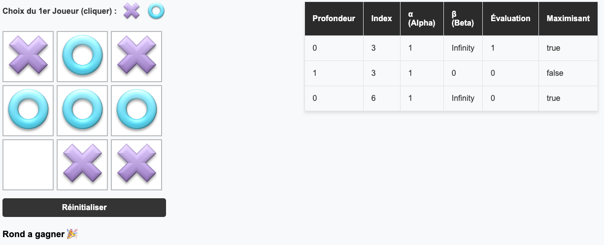

# Jeu de Morpion avec "IA" - Algo Minimax avec Élagage Alpha-Bêta

Ce projet est une implémentation du jeu classique de morpion (tic-tac-toe) avec une intelligence artificielle très basique pour un cours de programmation Web en L3 MIASHS, cet "IA" est intégrée en utilisant l'algorithme **minimax avec élagage alpha-bêta**.

## Fonctionnalités

- **Choix du premier joueur** : Le joueur peut choisir de commencer en tant que "Croix" ou "Rond".
- **IA intelligente** : L'ordinateur utilise l'algorithme minimax avec élagage alpha-bêta pour jouer de manière optimale.
- **Affichage des paramètres de recherche** : Un tableau affiche les paramètres internes de l'algorithme lors de chaque coup de l'IA, pour une meilleure compréhension du fonctionnement de l'algorithme.
- **Interface utilisateur conviviale** : Une grille interactive où le joueur peut cliquer pour effectuer ses mouvements.
- **Indicateur de résultat** : Affiche le gagnant ou indique si le match est nul.
- **Bouton de réinitialisation** : Permet de recommencer une nouvelle partie à tout moment.

# Comment démarrer le projet

## Prérequis

- Un navigateur web  (Chrome, Firefox, Edge, etc.).

## Instructions

1. **Cloner le dépôt ou télécharger les fichiers**

   ```bash
   git clone https://github.com/votre-utilisateur/votre-depot.git
   ```
2.	Accéder aux fichiers
      Naviguez vers le dossier où se trouvent les fichiers index.html, main.js, et le dossier img contenant les images nécessaires (croix.png, cercle.png, vide.png).
3. Ouvrir le jeu dans le navigateur
      Double-cliquez sur le fichier index.html pour l’ouvrir dans votre navigateur par défaut.

## Structure des fichiers

`index.html` : Contient la structure HTML du jeu, y compris la grille, les boutons de sélection et le tableau des paramètres de recherche.  
`main.js` : Contient toute la logique du jeu, y compris l’algorithme de l’IA, la gestion des événements et l’interaction avec le DOM.  
`img/` : Dossier contenant les images utilisées dans le jeu.  
`croix.png` : Image représentant la croix.  
`cercle.png` : Image représentant le rond.  
`vide.png` : Image pour une case vide.  

## Utilisation du jeu

    1. Sélection du premier joueur
	    Cliquez sur l’image de la croix ou du rond pour choisir qui commence la partie.  

	2. Jouer le jeu
        Cliquez sur une case vide de la grille pour placer votre symbole.
        L’IA jouera automatiquement après votre coup.
	    Le jeu continue jusqu’à ce qu’il y ait un gagnant ou un match nul.
	
    3. Visualiser les paramètres de l’IA
        Après chaque coup de l’IA, un tableau s’affiche sous le jeu montrant les paramètres internes de l’algorithme alpha-bêta pour ce coup.
    
    4. Réinitialiser le jeu
        Cliquez sur le bouton “Réinitialiser” pour recommencer une nouvelle partie.

## Comprendre le Tableau des Paramètres

Le tableau affiche les informations suivantes pour __**chaque noeud**__ exploré par l’algorithme :  
•	`Profondeur` : Niveau de profondeur dans l’arbre de recherche.  
•	`Index` : Case du plateau considérée pour le mouvement.  
•	`Alpha` : Meilleure valeur que le joueur maximisant peut garantir.  
•	`Beta` : Meilleure valeur que le joueur minimisant peut garantir.  
•	`Évaluation` : Score évalué pour le nœud actuel.  
•	`1` : Victoire pour l’IA.  
•	`0` : Match nul.  
•	`-1` : Défaite pour l’IA.  
•	`Maximisant` : Indique si le nœud correspond au tour du joueur maximisant (true pour l’IA) ou minimisant (false pour l’humain).  

## Aperçu




## Algorithme Minimax avec Élagage Alpha-Bêta

L’algorithme minimax avec élagage alpha-bêta est une optimisation de l’algorithme minimax classique qui permet de réduire le nombre de nœuds explorés dans l’arbre de jeu, sans affecter le résultat final.
•	Minimax : Algorithme utilisé pour déterminer le meilleur coup à jouer en explorant toutes les possibilités de jeu jusqu’à une certaine profondeur.
•	Élagage Alpha-Bêta : Technique qui permet d’ignorer certaines branches de l’arbre de jeu qui ne peuvent pas influencer la décision finale, améliorant ainsi l’efficacité de l’algorithme.

Pour en savoir plus, vous pouvez consulter l’article suivant : [Élagage alpha-bêta — Wikipédia](https://fr.wikipedia.org/wiki/%C3%89lagage_alpha-b%C3%AAta)
